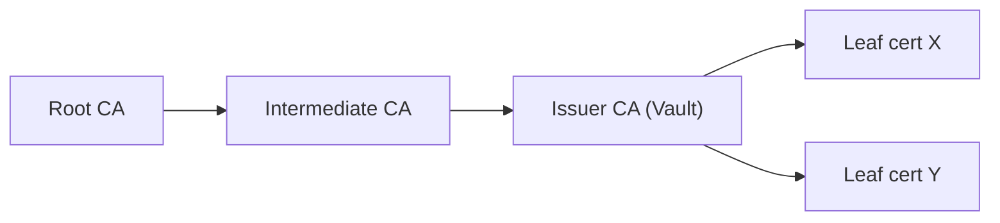

# Three-Tier Public Key Infrastructure (PKI) Setup

## Introduction

This project guides you through setting up a three-tier Public Key Infrastructure (PKI). A PKI is a set of roles, policies, hardware, software, and procedures needed to create, manage, distribute, use, store, and revoke digital certificates and manage public-key encryption.

Our three-tier PKI consists of:

1. Root Certificate Authority (CA)
2. Intermediate CA
3. End-entity certificates (e.g., for a Vault server)

This structure enhances security by minimizing the Root CA's exposure and provides a flexible, scalable solution for digital security.

## Use Cases

A properly configured PKI can be used in various scenarios, including:

1. **Secure Web Communication**: Enabling HTTPS for websites and web applications.
2. **Email Security**: Implementing S/MIME for email encryption and digital signatures.
3. **Code Signing**: Verifying the integrity and origin of software packages.
4. **VPN Authentication**: Securing remote access to corporate networks.
5. **IoT Device Authentication**: Ensuring the authenticity of Internet of Things (IoT) devices.
6. **Document Signing**: Providing digital signatures for legal and business documents.
7. **Secure Internal Communications**: Encrypting and authenticating communication between internal services and microservices.

## Potential Challenges

While setting up a PKI brings numerous benefits, there are some challenges to be aware of:

1. **Complexity**: Managing a PKI, especially a multi-tier setup, can be complex and requires careful planning and execution.

2. **Key Management**: Securely storing and managing private keys, especially the root CA key, is crucial and can be challenging.

3. **Certificate Lifecycle Management**: Keeping track of certificate expiration dates and managing renewals can be time-consuming.

4. **Revocation**: Implementing and maintaining an effective certificate revocation system (like CRL or OCSP) can be complex.

5. **Interoperability**: Ensuring certificates are recognized and work across different systems and platforms can sometimes be challenging.

6. **Skills and Knowledge**: Setting up and maintaining a PKI requires specialized knowledge, which may necessitate training or hiring experts.

7. **Scalability**: As your organization grows, scaling the PKI to meet increased demand while maintaining security can be challenging.

8. **Compliance**: Depending on your industry, you may need to ensure your PKI complies with specific standards or regulations.

## Getting Started

To begin setting up your three-tier PKI, please refer to the [PKI Setup Tutorial](pki-reference.md) in this repository. The tutorial provides step-by-step instructions for creating your Root CA, Intermediate CA, and end-entity certificates.

## Security Considerations

Remember that the security of your entire PKI depends on the security of your Root CA. It's recommended to keep the Root CA offline when not in use and to implement strong physical and digital security measures to protect it.

## Contributing

Contributions to improve the tutorial or add additional guidance are welcome. Please submit a pull request or open an issue to discuss proposed changes.

## License

This project is licensed under the MIT License - see the [LICENSE](LICENSE) file for details.
