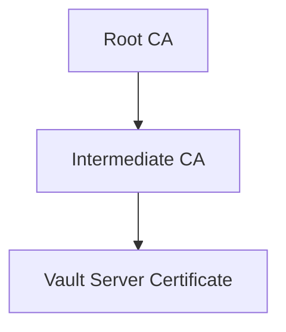

# Tutorial: Setting Up a Three-Tier Public Key Infrastructure (PKI)

## Introduction

This tutorial will guide you through setting up a three-tier Public Key Infrastructure (PKI). This structure consists of:

1. Root Certificate Authority (CA)
2. Intermediate CA
3. End Entities (e.g., Vault server)

This hierarchy enhances security and simplifies certificate management.




## Prerequisites

- OpenSSL installed on your system
- Basic understanding of terminal/command line operations

## Important Note

All certificates should be stored in a `.tls` directory, which is gitignored for security.

## Step 1: Generate the Root CA

1. Create the Root CA key:
   ```bash
   openssl ecparam -genkey -name secp384r1 -out .tls/root-ca-key.pem
   ```

2. Create the Root CA certificate:
   ```bash
   openssl req -x509 -new -nodes -key .tls/root-ca-key.pem -sha384 -days 3653 -out .tls/root-ca.pem
   ```
   
   You'll be prompted to enter details. Here's an example:
   - Country Name: US
   - State: New York
   - Locality: New York
   - Organization: YourOrgName
   - Organizational Unit: [Leave blank]
   - Common Name: YourOrgName.com
   - Email: admin@yourorgname.com

**Security Tip**: Store your Root CA in a secure, offline environment.

## Step 2: Generate the Intermediate CA

1. Create the Intermediate CA key:
   ```bash
   openssl ecparam -genkey -name secp384r1 -out .tls/intermediate-ca-key.pem
   ```

2. Generate the Certificate Signing Request (CSR):
   ```bash
   openssl req -new -key .tls/intermediate-ca-key.pem -out .tls/intermediate-ca.csr
   ```
   
   Fill in details similar to the Root CA, but use "YourOrgName Intermediate" as the Common Name.

3. Create a config file named `intermediate-ca.cnf`:
   ```ini
   [req]
   distinguished_name = orgname
   req_extensions = v3_req
   prompt = no

   [orgname]
   C = US
   ST = New York
   L = New York
   O = YourOrgName
   CN = YourOrgName Intermediate

   [v3_req]
   basicConstraints = critical,CA:true
   extendedKeyUsage = serverAuth, clientAuth
   keyUsage = critical, keyCertSign, cRLSign, digitalSignature, keyEncipherment
   ```

4. Generate the Intermediate CA certificate:
   ```bash
   openssl x509 -req -in .tls/intermediate-ca.csr -CA .tls/root-ca.pem -CAkey .tls/root-ca-key.pem -CAcreateserial -out .tls/intermediate-ca.pem -days 1827 -sha384 -extfile intermediate-ca.cnf -extensions v3_req
   ```

## Step 3: Create the Vault Server Certificate

1. Create a config file named `vault.cnf`:
   ```ini
   [req]
   distinguished_name = vault
   req_extensions = v3_req
   prompt = no

   [vault]
   C = US
   ST = New York
   L = New York
   O = YourOrgName
   CN = yourorgname.com

   [v3_req]
   keyUsage = critical, digitalSignature, keyEncipherment
   extendedKeyUsage = serverAuth, clientAuth
   subjectAltName = @alt_names

   [alt_names]
   DNS.1 = vault.yourorgname.com
   ```
**Important**: Include your vault instance IPs or domain names within [alt names] otherwise vault will fail to complete tls handshake when trying to join the cluster

2. Generate the Vault server key and CSR:
   ```bash
   openssl genrsa -out .tls/vault-key.pem 2048
   openssl req -new -key .tls/vault-key.pem -out .tls/vault.csr -config vault.cnf
   ```

3. Create the Vault server certificate:
   ```bash
   openssl x509 -req -in .tls/vault.csr -CA .tls/intermediate-ca.pem -CAkey .tls/intermediate-ca-key.pem -CAcreateserial -out .tls/vault.pem -days 365 -sha384 -extfile vault.cnf -extensions v3_req
   ```

## Step 4: Generate and Verify the Full CA Chain

1. Create the full CA chain:
   ```bash
   cat .tls/intermediate-ca.pem .tls/root-ca.pem > .tls/ca-chain.pem
   ```

2. Verify the Vault server certificate:
   ```bash
   openssl verify -CAfile .tls/ca-chain.pem .tls/vault.pem
   ```
   
   You should see the output: `vault.pem: OK`

3. (Optional) View the Vault server certificate details:
   ```bash
   openssl x509 -in .tls/vault.pem -noout -text
   ```

Congratulations! You've now set up a three-tier PKI with a Root CA, Intermediate CA, and a Vault server certificate.
